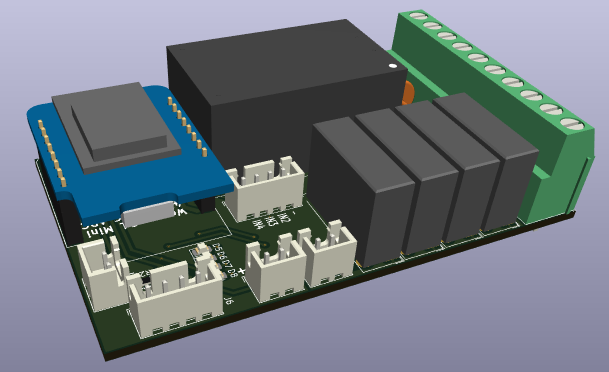

# Wemos D1 Mini 4 Node Smart Control

## 📌 Table of Contents

- [About the Project](#about-the-project)
- [Screenshots](#screenshots)
- [Usage](#usage)
- [Configuration for Tasmota](#configuration)

---

## 📖 About the Project

This is PCB design for smart control based on ESP8266 Wemos D1 mini module. It has 4 inputs which can be connected to AC switch and 4 outputs can be connected to loads. 
The board can be fitted behind the switchboard as an after market fit without rewiring, provided there is a neutral line available. 

## 🖼 Screenshots

## 🚀 Usage
The design was done for using with Tasmota firmware, but user can use any firmware which can support the below configuraton.
- Inputs: D0, D1, D2 and D3
- Outputs: D5, D5, D7 and D8

  Note: D3 has a pull-up and boot fails if pulled down during power on. 

Additional usage instructions and examples.

## ⚙️ Configuration for Tasmota
Following configuration can be used for Tasmota firmware.

## 📜 License

This project is licensed under the MIT License 
